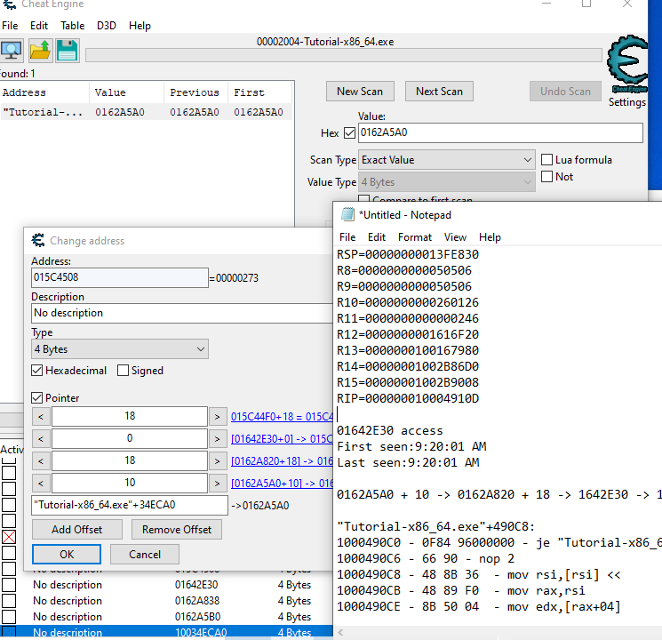

## cheat engine 튜토리얼을 연습해보자

작성자: kkongnyang2 작성일: 2025-07-14

---

### CE tutorial 1~4

주소 탐색
```
newscan 누르기
창에 initial 값 입력 후 firstscan
값 변화시키기
창에 second 값 입력 후 nextscan
목록 추려지면 클릭해서 아래 작업바에 내리고 값 조작
```

### 빌드와 런 이해하기

빌드 = 소스 파일을 실행 파일로 컴파일. 단 한번.
런 = 그 실행 파일이 메모리에 올라와서 프로세스로 돌아감.

빌드는 소스 파일의 모든 함수를 어셈블리어로 만들고 .text와 .data 등 섹션을 나눠 저장한다. 어차피 전부 가상주소긴 해도 함수 간의 오프셋은 완벽하게 고정된다. 그렇기에 press_button() 함수에서 hp_edit() 함수로, struct player 데이터로, 이 사이에는 정해진 거리가 있어 그렇게 호출이 가능하다. 그걸 오프셋이라 부른다.

```
# foo() 안에서 bar() 호출 (x86-64 PIE)
call  [rip + 0x34]   ; ← 0x34는 bar 까지의 거리

# 만약 진짜 외부에 있으면?(라이브러리 등)
# 외부 심볼 bar() 호출
call  QWORD PTR [rip + .got.plt.bar]  ; GOT 슬롯에 patch된 절대주소를 읽음
```
```
0x000055f4_9c8a0000  ── [텍스트]  ← PIE 베이스 (ASLR로 매 실행마다 변동)
                     ├─ [rodata]
                     ├─ [data]     ← g_player
                     ├─ [bss]
                     ├─ (heap)     ← malloc() 구조체들 … ↑ 성장
0x00007f3d_40000000  ── [libc.so]  ← 공유 라이브러리 베이스
                     ├─ 기타 .so …
                     ├─ (익명 mmap/JIT 영역)
0x00007ffe_fffe0000  ── [stack]    ← 스레드마다 새로, 위에서 ↓ 성장
```

우리가 이걸 런하면 새로 순차적으로 코드들이 생기는 게 아니라 이 빌드 실행 파일 안에서 위치만 옮겨가며 각 줄을 cpu로 작동시키는 것이다. 모든 행동은 이미 완벽하게 규율로 지정되어 있다. 하드웨어 인터럽트가 커널 단에서 작동되면 그게 어느 주소로 향하고 그 다음은 어디로 정해져 있는지의 문제이다. 물론 인터럽트에 의해 새로 할당되는 데이터들도 있긴 하다. 이것들은 힙, 스택들로 쌓인다.

즉, 빌드는 완벽히 고정된 퍼즐, 런은 베이스 주소를 기반으로 그 퍼즐 전체를 그대로 올리고, 사용자 인터럽트에 의해 추가 데이터가 더 할당되는 것.

```
┌─[빌드 단계]─────────────────────────────────────────┐
│ ① 모든 코드·전역·상수 → 한 퍼즐처럼 “세그먼트 + 오프셋” 고정 │
│    (.text / .rodata / .data / .bss)                          │
└──────────────────────────────────────────────────────────────┘
         ↓ execve()
┌─[런타임: 프로세스 시작]──────────────────────────────┐
│ ② 커널·ld.so가 베이스 주소(ASLR)만 정해 mmap       │
│    ──> “퍼즐” 전체를 한 번에 가상공간에 올림        │
└────────────────────────────────────────────────────┘
         ↓ 게임 진행
┌─[런타임: 동적 동작]────────────────────────────────┐
│ ③ 사용자 입력·네트워크 이벤트 등 → 힙/스택/mmap에 │
│    새 객체·버퍼를 **필요할 때마다** 추가           │
└────────────────────────────────────────────────────┘
```

참고로 모든 프로세스들은 메모리 뒷부분에 커널을 공통으로 가지고 있다.

### CE tutorial 5,7

코드 무효화
```
값 주소 탐색 후 what writes this address 들어가서 디스어셈블러 보기. 해당 줄 코드를 replace with code that does nothing 또는 add 2로 바꾸면 체력값을 쓰는 코드가 무효화되거나 오히려 플러스로 바뀐다.
```

코드 인젝션
```
디스어셈블리에서 ctrl+A 눌러 어셈블러 창 열기. code injection을 클릭하고 원하는 부분의 내용 수정
```

프리징
```
active X를 체크해주면 이제 그 일반 주소 또는 체인 주소는 활동을 못하게됨. 프로그램 베이스가 바뀌고 뭘 쓰려해도 계속 체인 쫓아가서 끝에 내가 써준 값으로 덮어쓰기함.
```

### CE tutorial 6,8

게임 진행 도중 새 플레이어의 hp와 ammo를 어떻게 할당할까?

struct player *p = malloc(sizeof *p);   // (1) rax ← 새 힙 주소
g_local_player   = p;                   // (2) 코드가 전역 변수에 저장

이런 구조를 통해 할당한다. 따라서 우리는 플레이어 마다 값이 적힌 주소를 일일히 찾아다닐게 아니라, 저 할당하고 포인터하는 (베이스 주소 기준으로)고정된 진원지 자체를 찾아야 한다.

```
[game.bin+0x1BCF30]   → 0x0000006002A000   (전역 포인터, 오프셋 고정)
                                    │
                                    ├─ hp  = *(+0x00)
                                    ├─ ammo= *(+0x04)
                                    └─ pos  = *(+0x08) …
```

우리는 저 값이 담긴 주소를 누가 access 하는지 진원지를 찾을 것이다. 튜토리얼에서 change value라는 버튼을 눌러서 값을 할당하고 쓰기 명령을 내렸다 했을 때 이를 따라가보자.

먼저 용어 정리.
베이스 주소는 런할때 정해지는 영점 조절 같은 것이다. game.bin
포인터는 값 부분에 수치를 입력하는게 아니라 주소를 입력하는 4바이트(64비트 os면 8바이트)다. 0x0000006002A000라는 주소값을 적어준다.
오프셋은 고정된 퍼즐에서의 거리를 뜻한다. +뒤에 적힌 걸 의미한다.

만약 빌드 때 이미 위치가 정해진 정적 데이터면 포인터를 쓸 필요도 없이 거리로 바로 읽으면 된다.


값에서부터 체인 따라가기
```
Find out what writes to this address -> 쓰기 타입 명령만
Find out what accesses this address -> 모든 타입 명령(참조 등등)

# 값이 담긴 주소 탐색
# 15C4508. what writes
# 체력값 16F를 15C44F0 + 18 위치에 적으라는 코드 발견
"Tutorial-x86_64.exe"+4910A:
10004910A - 89 46 18  - mov [rsi+18],eax <<
RAX=000000000000016F
RSI=00000000015C44F0

# 15C44F0를 포인팅 하는 주소 탐색
# 1642E30. what access
# 1642E30 위치에 있던 값 15C44F0을 불러오는 코드 발견
"Tutorial-x86_64.exe"+490C8:
1000490C8 - 48 8B 36  - mov rsi,[rsi] <<
RAX=0000000001642E30
RSI=00000000015C44F0

# 1642E30을 포인팅 하는 주소 탐색
# 162A838. what access
# 162A820 + 18 위치에 있던 값 1642E30을 불러오는 코드 발견
"Tutorial-x86_64.exe"+4907C:
10004907C - 48 8B 76 18  - mov rsi,[rsi+18] <<
RAX=000000000162A820
RSI=0000000001642E30

# 162A820을 포인팅 하는 주소 탐색
# 162A5B0. what access
# 162A5A0 + 10 위치에 있던 값 162A820을 불러오는 코드 발견
"Tutorial-x86_64.exe"+49034:
100049034 - 48 8B 76 10  - mov rsi,[rsi+10] <<
RAX=000000000162A5A0
RSI=000000000162A820

# 162A5A0을 포인팅 하는 주소 탐색
# "tutorial-x86_64.exe"+34ECA0.

10034ECA0 -> 162A5A0 + 10 -> 162A820 + 18 -> 1642E30 -> 15C44F0 + 18 -> 16F

# add address manually 누르고 tutorial-x86_64.exe 부터 체인 연결해주면 됨
```



### 메모리 전수 자동 스캐너


체인의 구조를 이해했으면 앞으로 편하게 뽑으면 된다


메모리 전수 스캔
```
값 탐색해서 주소 찾기
pointer scan for this address(자동 스캐너 이용)
scan for address으로 노드당 offset 가지, offset 최대 value, level을 적어주고 ptr 파일 저장
치팅 중인 프로그램 종료 후 재실행, CE도 재접속
다시 값 탐색해서 주소 찾기
pointer scan for this address 누르고 페이지 들어와지면 file에서 이전 ptr 파일 불러오기
새 주소로 rescan하면 후보가 줄어들음
반복
하나만 남으면 클릭하면 작업바에 추가됨
```

혹은 대형 프로그램 메모리 전수 스캔
```
값 탐색해서 주소 찾기
pointer scan for this address(자동 스캐너 이용)
generate pointermap으로 첫번째 ptr 파일 저장
치팅 중인 프로그램 종료 후 재실행, CE도 재접속
다시 값 탐색해서 주소 찾기
pointer scan for this address 누르고 generate pointermap으로 두번째 ptr 파일 저장
이제 scan for address로 전환하고 use saved pointermap 체크해 첫번째 ptr 파일 선택
Compare results with other saved pointermap 체크해 두번째 ptr 파일 선택
여러번 해서 하나만 남으면 클릭하면 작업바에 추가됨
```


### Structures

"이 베이스 주소를 시작으로 0x0, 0x4, 0x8… 오프셋마다 필드를 해석해 구조체처럼 보자"
① Add address: 베이스(예: [[playerBasePtr]+0x30])를 열 기준으로 추가
② Define new structure: 크기 입력(보통 0x400~0x1000) → 초기 템플릿 생성
③ Auto-fill/Guess field type: 패턴을 보고 4 Byte 정수·Float·Pointer 등을 자동 추정
④ Column compare: 동일 구조체를 두 인스턴스(플레이어 1 vs 2)로 나란히 배치, 차이가 나는 오프셋 강조
⑤ 필드명·타입 더블클릭 → Rename & Re-type 지원

### AoB 스캔

일련의 명령어 바이트 시퀀스(예: 48 8B 05 ?? ?? ?? ?? 89 83)를 야생의 고유지문처럼 저장해 두었다가, 다음 실행에서 다시 검색하여 같은 코드 위치를 찾는 방식. 업데이트로 모듈 크기와 베이스가 바뀌어도 패턴으로 찾는 거기에 성공률이 높음.

### Dissect code

"이 모듈(예: game.exe)의 코드 구성을 통째로 해부해서 함수·분기·호출 관계를 탐색하자."
① 모듈/영역 선택 → .text(실행 코드) 섹션 전체를 빠르게 스캔
② Function list 생성: CE가 ret·call 패턴을 기반으로 함수 경계 자동 추정
③ X-ref(교차 참조): 해당 주소를 호출·점프하는 모든 지점 나열
④ 라벨·주석 달기, 기계어 ↔ Mnemonics(어셈블리) 보기 전환
⑤ Graph view(선택): 기본 블록 흐름도를 시각화